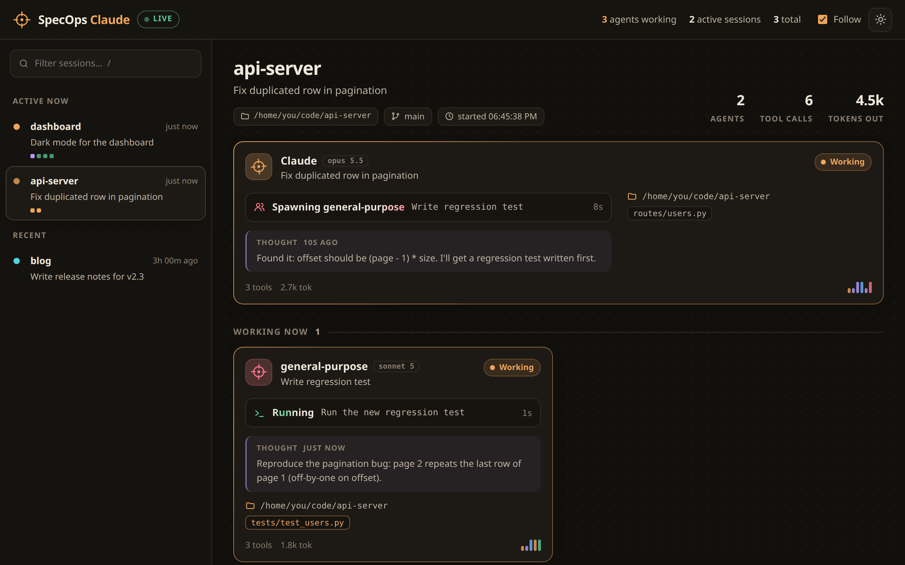
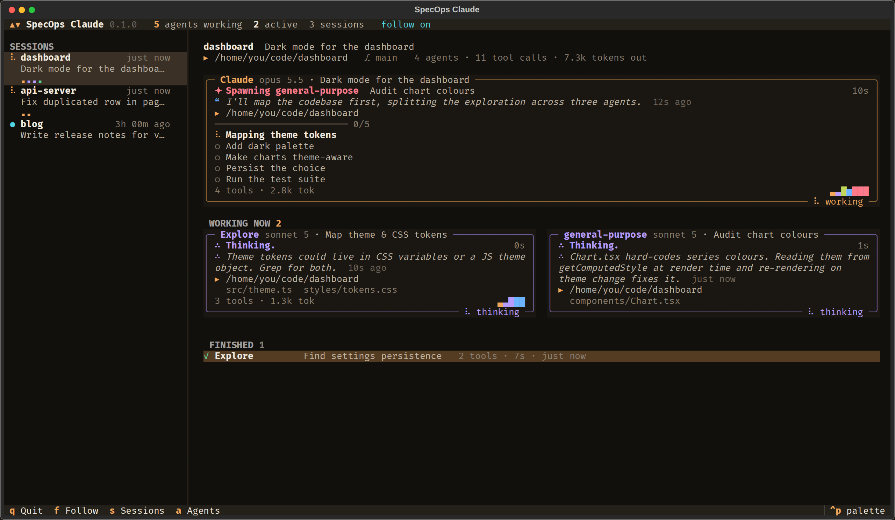
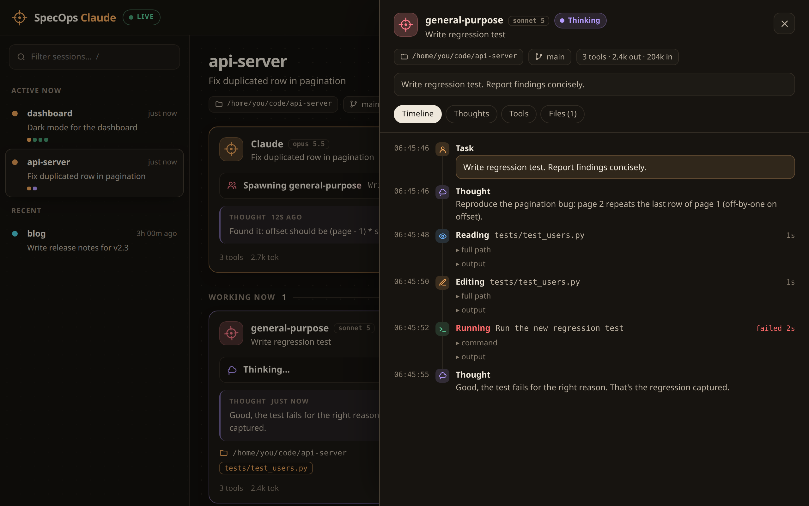
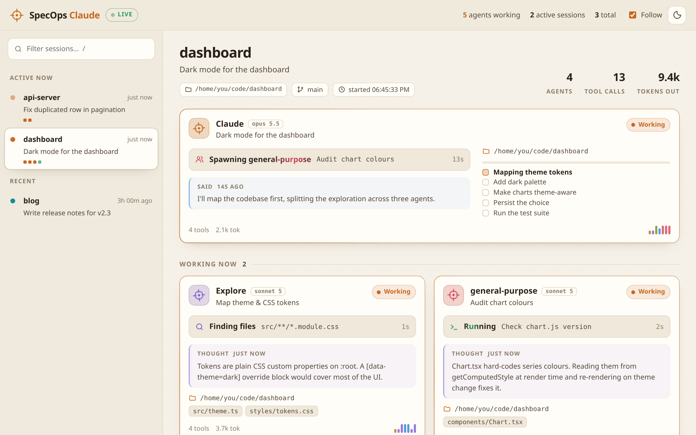
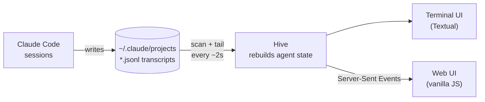

<div align="center">


# SpecOps Claude

**Mission control for your Claude Code agents.**
Watch every agent and subagent work in real time, in the terminal or in the browser.

[](https://github.com/medeirosdev/SpecOps-Claude/actions/workflows/ci.yml)


[](LICENSE)


[Quick start](#-quick-start) · [Features](#-features) · [Usage](#-usage) · [How it works](#-how-it-works) · [Privacy](#-privacy) · [Development](#-development)

<br>



</div>

---

When Claude fans out to three `Explore` agents and a `general-purpose` one, your terminal shows you
a spinner. **SpecOps Claude shows you the whole squad:** who is working, what each agent is doing
right now (reading which file, running which command), what it last thought, its todo list, and a
full timeline you can open for any agent.

It works by reading the transcripts Claude Code already writes to `~/.claude/projects`.
**No hooks, no config, no API keys, and nothing leaves your machine.**

## ✨ Features

<table>
<tr>
<td width="50%" valign="top">

### 🎯 Live agent cards
Every agent and subagent gets a card with its current action (*Reading `src/theme.ts`*,
*Running `pytest`*), its latest thought, files touched, todos, and token usage.

</td>
<td width="50%" valign="top">

### 🧭 Full chain of command
Subagents are linked to the agent that spawned them, including subagents of subagents.
Jump from any spawn straight to the agent it started.

</td>
</tr>
<tr>
<td valign="top">

### 🕓 Timelines
Open any agent for its complete history, filtered by thoughts, tools, or files, with every tool
input and output.

</td>
<td valign="top">

### 📡 Follow mode
Start `claude` in any project and its session shows up on its own. With **Follow** on, the view
jumps to whichever session is working.

</td>
</tr>
<tr>
<td valign="top">

### 🖥️ Terminal or browser
A keyboard-driven [Textual](https://textual.textualize.io/) TUI, or a web dashboard with light
and dark themes. Both render the same live snapshot.

</td>
<td valign="top">

### 🔒 Local and read-only
It only reads files that are already on your disk. The web UI binds to `127.0.0.1`, and there's
nothing to install into Claude Code.

</td>
</tr>
</table>

## 🚀 Quick start

```sh
uv tool install git+https://github.com/medeirosdev/SpecOps-Claude
# or: pipx install git+https://github.com/medeirosdev/SpecOps-Claude
```

Then:

```sh
specops              # terminal dashboard
specops web          # browser dashboard on http://localhost:7777
specops --demo       # a simulated squad, to try it without Claude running
```

Want to try it without installing anything?

```sh
uvx --from git+https://github.com/medeirosdev/SpecOps-Claude specops --demo
```

Requires Python 3.10+.

## 🕹️ Usage

| Option | |
| --- | --- |
| `--since 30m` / `6h` / `2d` / `all` | only show sessions active in this window (default `12h`) |
| `-p, --project TEXT` | only show projects whose path contains `TEXT` |
| `--root DIR` | transcripts directory (default `~/.claude/projects`, or `$CLAUDE_CONFIG_DIR/projects`) |
| `--demo` | watch a simulated squad |
| `web --port 7777` | port for the browser UI (the next free one is used if it's busy) |
| `web --host 127.0.0.1` | interface to bind; read [Privacy](#-privacy) before changing it |
| `web --no-browser` | don't open a browser tab |

### In the terminal



| Key | |
| --- | --- |
| `s` / `a` | focus the session list / the agent cards |
| `↑` `↓`, `Tab` | move around |
| `Enter` | open the focused agent's timeline |
| `1` `2` `3` `4` | timeline tabs: everything, thoughts, tools, files |
| `Esc` | back |
| `f` | toggle follow |
| `q` | quit |

### In the browser

Click any agent card (or a finished agent) for its full timeline, with tool inputs and outputs.
"open agent →" on a spawn jumps to the subagent it started.



| Key | |
| --- | --- |
| `/` | filter sessions |
| `j` / `k` | next / previous session |
| `f` | toggle follow |
| `t` | light / dark theme |
| `Esc` | close the timeline |

<details>
<summary><b>☀️ Light theme</b></summary>
<br>

</details>

## ⚙️ How it works

Claude Code appends one JSON event per line to `~/.claude/projects/<project>/<session>.jsonl`.
Each subagent gets its own `<session>/subagents/agent-<id>.jsonl`, plus a `.meta.json` naming its
type and the tool call that spawned it.



SpecOps Claude:

1. scans for recently modified transcripts every couple of seconds,
2. tails each one (big transcripts are read from the last 4 MB, so they open instantly),
3. rebuilds each agent's state from the events: phase (thinking, running a tool, writing, waiting
   for you, done), pending tool calls, files touched, todos, token usage,
4. links each subagent to the agent that spawned it, including subagents of subagents.

The web server uses only the standard library (HTTP + Server-Sent Events), and the frontend is
vanilla JS with no build step.

An agent that stops producing events is shown as idle after 3 minutes (30 minutes while a tool is
running, since builds and test suites can be slow).

> [!NOTE]
> The transcript format is internal to Claude Code and undocumented. SpecOps Claude reads it
> defensively: unknown events are skipped rather than crashing the viewer, but a Claude Code update
> can still make something display oddly. Please
> [open an issue](https://github.com/medeirosdev/SpecOps-Claude/issues) if it does.

## 🔒 Privacy

Transcripts hold your prompts, code, and command output. SpecOps Claude only reads them locally,
and the web UI binds to `127.0.0.1` by default.

> [!WARNING]
> If you pass `--host 0.0.0.0`, anyone who can reach that port can read all of it. There is no
> authentication.

## 🛠️ Development

```sh
git clone https://github.com/medeirosdev/SpecOps-Claude && cd SpecOps-Claude
uv run specops --demo          # run from source
uv run pytest                  # tests
uv run ruff check src tests && uv run ruff format src tests
```

`tests/fixtures` has a small real-format session with a subagent. The demo
(`src/specops/demo.py`) writes realistic transcripts to a temp directory, so it goes through the
same pipeline as real sessions.

## 📄 License

[MIT](LICENSE) © Guilherme Medeiros

<div align="center">
<sub>Not affiliated with Anthropic. Claude and Claude Code are trademarks of Anthropic.</sub>
</div>
