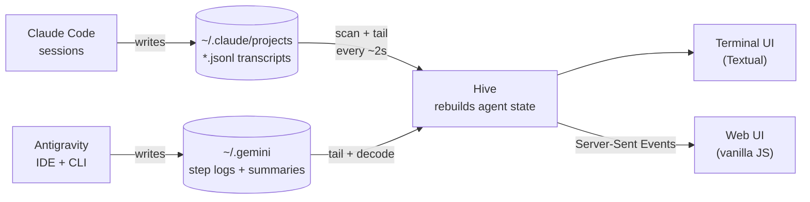

<div align="center">


# SpecOps Agents

**Mission control for your Claude Code and Antigravity agents.**
Watch every agent and subagent work in real time, in the terminal or in the browser.

[](https://github.com/medeirosdev/SpecOps-Claude/actions/workflows/ci.yml)


[](LICENSE)


[Quick start](#quick-start) · [Features](#features) · [Usage](#usage) · [Context, cost, warnings](#context-cost-and-warnings) · [Skills](#skills) · [Antigravity](#antigravity) · [How it works](#how-it-works) · [Privacy](#privacy) · [Development](#development)

<br>


</div>

---

When Claude fans out to three `Explore` agents and a `general-purpose` one, your terminal shows you
a spinner. **SpecOps Agents shows you the whole squad:** who is working, what each agent is doing
right now (reading which file, running which command), what it last thought, its todo list, and a
full timeline you can open for any agent.

It works by reading the transcripts Claude Code already writes to `~/.claude/projects`, and the
step logs Google's [Antigravity](#antigravity) IDE and CLI keep in `~/.gemini`, so both kinds of
agents show up side by side. **No hooks, no config, no API keys, and nothing leaves your machine.**

## Features

<table>
<tr>
<td width="50%" valign="top">

### Live agent cards
Every agent and subagent gets a card with its current action (*Reading `src/theme.ts`*,
*Running `pytest`*), its latest thought, files touched, todos, and token usage.

</td>
<td width="50%" valign="top">

### Full chain of command
Subagents are linked to the agent that spawned them, including subagents of subagents.
Jump from any spawn straight to the agent it started.

</td>
</tr>
<tr>
<td valign="top">

### Timelines
Open any agent for its complete history, filtered by thoughts, tools, or files, with every tool
input and output.

</td>
<td valign="top">

### Follow mode
Start `claude` in any project and its session shows up on its own. With **Follow** on, the view
jumps to whichever session is working.

</td>
</tr>
<tr>
<td valign="top">

### Terminal or browser
A keyboard-driven [Textual](https://textual.textualize.io/) TUI, or a web dashboard with light
and dark themes. Both render the same live snapshot.

</td>
<td valign="top">

### Local and read-only
It only reads files that are already on your disk. The web UI binds to `127.0.0.1`, and there's
nothing to install into Claude Code.

</td>
</tr>
<tr>
<td valign="top">

### Antigravity too
Conversations from the Antigravity IDE and the `agy` CLI appear next to your Claude sessions,
tagged **Antigravity**, with their tool calls, files, task list, and the model in use.

</td>
<td valign="top">

### One view for every agent
Claude Code in one project, Antigravity in another: a single list, sorted by what's active,
with Follow jumping to whichever agent is working.

</td>
</tr>
<tr>
<td valign="top">

### Context and cost
A bar shows how full each agent's context window is, next to its cache hit rate and what the
session would cost at API prices, per agent and in total.

</td>
<td valign="top">

### Stuck agent warnings
An agent that repeats the same call without changing anything, keeps failing, rewrites one file
over and over, or waits on a command that never returns gets flagged.

</td>
</tr>
<tr>
<td colspan="2" valign="top">

### One skill library for both
Write a skill once in the **Skills** tab and publish it to Claude Code and Antigravity, for every
project or just one. Editing is locked behind a code only your terminal sees.

</td>
</tr>
</table>

## Quick start

```sh
uv tool install git+https://github.com/medeirosdev/SpecOps-Claude
# or: pipx install git+https://github.com/medeirosdev/SpecOps-Claude
```

Then:

```sh
specops              # terminal dashboard
specops web          # browser dashboard on http://localhost:7777
specops --demo       # a simulated squad, to try it without Claude running
```

Want to try it without installing anything?

```sh
uvx --from git+https://github.com/medeirosdev/SpecOps-Claude specops --demo
```

Requires Python 3.10+.

## Usage

| Option | |
| --- | --- |
| `--since 30m` / `6h` / `2d` / `all` | only show sessions active in this window (default `12h`) |
| `-p, --project TEXT` | only show projects whose path contains `TEXT` |
| `--root DIR` | transcripts directory (default `~/.claude/projects`, or `$CLAUDE_CONFIG_DIR/projects`) |
| `--demo` | watch a simulated squad |
| `--no-antigravity` | leave out Antigravity IDE / CLI conversations |
| `web --port 7777` | port for the browser UI (the next free one is used if it's busy) |
| `web --host 127.0.0.1` | interface to bind; read [Privacy](#privacy) before changing it |
| `web --no-browser` | don't open a browser tab |
| `web --read-only` | show the skill library but never write skills |

### In the terminal


| Key | |
| --- | --- |
| `s` / `a` | focus the session list / the agent cards |
| `↑` `↓`, `Tab` | move around |
| `Enter` | open the focused agent's timeline |
| `1` `2` `3` `4` | timeline tabs: everything, thoughts, tools, files |
| `Esc` | back |
| `f` | toggle follow |
| `q` | quit |

### In the browser

Click any agent card (or a finished agent) for its full timeline, with tool inputs and outputs.
"open agent →" on a spawn jumps to the subagent it started.


| Key | |
| --- | --- |
| `/` | filter sessions |
| `j` / `k` | next / previous session |
| `f` | toggle follow |
| `t` | light / dark theme |
| `Esc` | close the timeline |

<details>
<summary><b>Light theme</b></summary>
<br>

</details>

## Context, cost, and warnings

**Context.** Each card shows how many tokens were in the agent's latest request, against the
model's context window (1M for current Opus, Sonnet and Fable models, 200K for Haiku 4.5 and
models SpecOps doesn't know). The bar turns orange past 50% and red past 80%, which is when
Claude Code is about to compact the conversation and details start getting summarized away.
Hover it for the share of prompt tokens read from the prompt cache.

**Cost.** Token usage from the transcript is priced at Anthropic's API list prices (cache reads
and 5-minute / 1-hour cache writes at their own rates, fast mode at 2x). It's an estimate: on a
Pro or Max plan, Claude Code usage isn't billed per token, so read it as "what this would cost
on the API". Models without a known price show no cost rather than a guess; prices live in
[`pricing.py`](src/specops/pricing.py). Transcripts over 4 MB are only read from the end, so their
cost is shown as a lower bound (`≥ $12.40`).

**Warnings.** While an agent is working, its recent tool calls are checked for:

| Warning | When |
| --- | --- |
| Same call repeated | the identical call (same tool, same input) 3 times in the last 10 calls, with no file edited in between |
| Keeps failing | the same call failing 3 times in the last 15, even with edits between tries, or 3 failed calls in a row |
| One file over and over | the same file edited 6 times in the last 12 calls |
| No result | a call still running after 10 minutes (subagents and questions to you are exempt) |

Polling tools (`BashOutput`, `Monitor`, `TaskOutput`, ...) are allowed to repeat. Antigravity
doesn't log tool results, so its agents are only checked for repeated calls and repeated edits. Flagged
sessions get a ↻ badge in the list, and the top bar counts how many agents need a look.
`specops --demo` includes an agent that retries a failing migration, to see one.

## Skills

The **Skills** tab keeps one library of skills and publishes them where agents look for them.
Claude Code and Antigravity read the same format (a folder with a `SKILL.md` holding a `name`,
a `description` of when to use it, and instructions), so one skill serves both.

| | Everywhere | One project |
| --- | --- | --- |
| Claude Code | `~/.claude/skills/<name>` | `<project>/.claude/skills/<name>` |
| Antigravity | `~/.gemini/config/skills/<name>` | `<project>/.agents/skills/<name>` |

- Skills live in `~/.specops/skills/` and are **copied** where you publish them. Saving a skill
  updates every published copy.
- Each copy carries a `.specops-skill.json` marker. A folder without it (a skill you made
  elsewhere) is never overwritten or deleted, and a copy edited by hand since publishing is only
  replaced or removed after you confirm. Existing skills can be imported into the library.
- Projects are the folders where SpecOps has seen an agent session, never an arbitrary path.
- Every change is logged to `~/.specops/audit.log` and shown in the tab.
- Sessions that are already running may need a restart to pick up a new skill.

### Unlocking edits

Reading the tab is open, but writing skills means writing instructions agents will follow, so
editing is locked. When `specops web` starts it prints an **unlock code** in the terminal:

```
  🔑 skills unlock code: 7KQ2M-XW4PD  (single use: type it in the browser to edit skills)
```

Type it in the browser to unlock. What protects the write path:

| Layer | What it stops |
| --- | --- |
| Unlock code printed only in the terminal, single use, replaced after every unlock | anyone without access to your terminal |
| 5 wrong codes lock unlocking for 5 minutes and replace the code | guessing |
| 256-bit session token, kept as a hash, compared in constant time; expires after 15 min idle or 8 h | stolen or forgotten sessions |
| `Host` must be localhost; `Origin` must be this server, `Sec-Fetch-Site: same-origin` | other websites (CSRF) and DNS rebinding |
| JSON body plus a custom `X-SpecOps` header, no CORS | forms and "simple" cross-site requests |
| Strict Content-Security-Policy (no inline or third-party scripts), no framing | turning a display bug into token theft, clickjacking |
| Writes only on a loopback bind; `--read-only` turns them off | exposing edits over the network |
| Names limited to `a-z0-9-`, writes confined to the skills folders, symlinks never followed or copied | path traversal and leaking files through links |

## Antigravity

If you use Google's Antigravity, its conversations show up automatically, tagged **Antigravity**
(IDE) or **Antigravity CLI**. Nothing to configure; pass `--no-antigravity` to hide them.

| What you see | Where it comes from |
| --- | --- |
| Prompts, replies, thinking (CLI), and every tool call with its arguments | `~/.gemini/antigravity*/brain/<id>/.system_generated/logs/` (JSONL step logs) |
| Todo list | the agent's `brain/<id>/task.md` checklist |
| Title, workspace, running or idle, the step waiting for your approval | trajectory summaries (protobuf) in the IDE's `state.vscdb` and the CLI's `conversation_summaries.db` |
| Subagents (CLI) | parent links in `conversation_summaries.db` |
| Model | the model picker setting recorded in the prompt |

What to expect:

- Antigravity logs a step once it finishes, so a tool shows as running until the agent's next
  reply appears, and tool outputs aren't shown.
- The IDE writes its summaries every so often, so "running / idle" can lag a little. The step log
  itself updates as the agent works.
- Token usage isn't recorded, so Antigravity cards show tool counts only.
- The full IDE conversations (`conversations/*.pb`) are encrypted and not read.
- None of this is a documented format. SpecOps Agents decodes it defensively and skips anything
  it doesn't recognise, but an Antigravity update can change it.

## How it works

Claude Code appends one JSON event per line to `~/.claude/projects/<project>/<session>.jsonl`.
Each subagent gets its own `<session>/subagents/agent-<id>.jsonl`, plus a `.meta.json` naming its
type and the tool call that spawned it.



SpecOps Agents:

1. scans for recently modified transcripts every couple of seconds,
2. tails each one (big transcripts are read from the last 4 MB, so they open instantly),
3. rebuilds each agent's state from the events: phase (thinking, running a tool, writing, waiting
   for you, done), pending tool calls, files touched, todos, token usage,
4. links each subagent to the agent that spawned it, including subagents of subagents.

The web server uses only the standard library (HTTP + Server-Sent Events), and the frontend is
vanilla JS with no build step.

An agent that stops producing events is shown as idle after 3 minutes (30 minutes while a tool is
running, since builds and test suites can be slow).

> [!NOTE]
> The transcript format is internal to Claude Code and undocumented. SpecOps Agents reads it
> defensively: unknown events are skipped rather than crashing the viewer, but a Claude Code update
> can still make something display oddly. Please
> [open an issue](https://github.com/medeirosdev/SpecOps-Claude/issues) if it does.

## Privacy

Transcripts and Antigravity logs hold your prompts, code, and command output. SpecOps Agents only
reads them locally, and the web UI binds to `127.0.0.1` by default.

> [!WARNING]
> If you pass `--host 0.0.0.0`, anyone who can reach that port can read all of it. There is no
> authentication.

## Development

```sh
git clone https://github.com/medeirosdev/SpecOps-Claude && cd SpecOps-Claude
uv run specops --demo          # run from source
uv run pytest                  # tests
uv run ruff check src tests && uv run ruff format src tests
```

`tests/fixtures` has a small real-format session with a subagent. The demo
(`src/specops/demo.py`) writes realistic transcripts to a temp directory, so it goes through the
same pipeline as real sessions.

## License

[MIT](LICENSE) © Guilherme Medeiros

<div align="center">
<sub>Not affiliated with Anthropic. Claude and Claude Code are trademarks of Anthropic.</sub>
</div>
